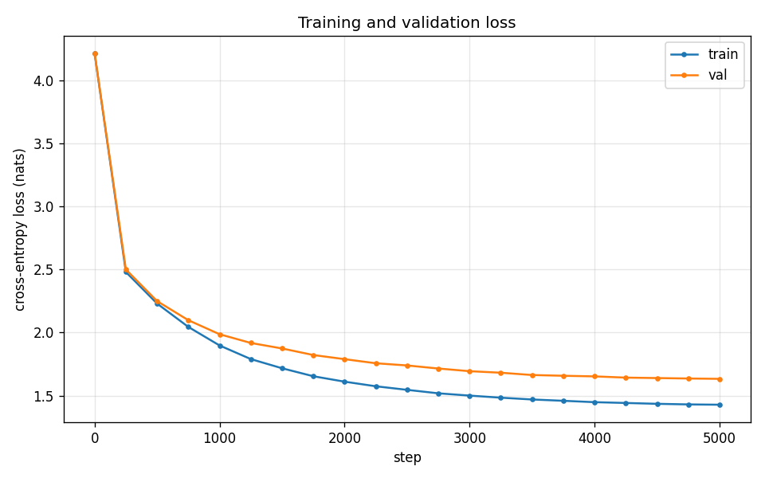
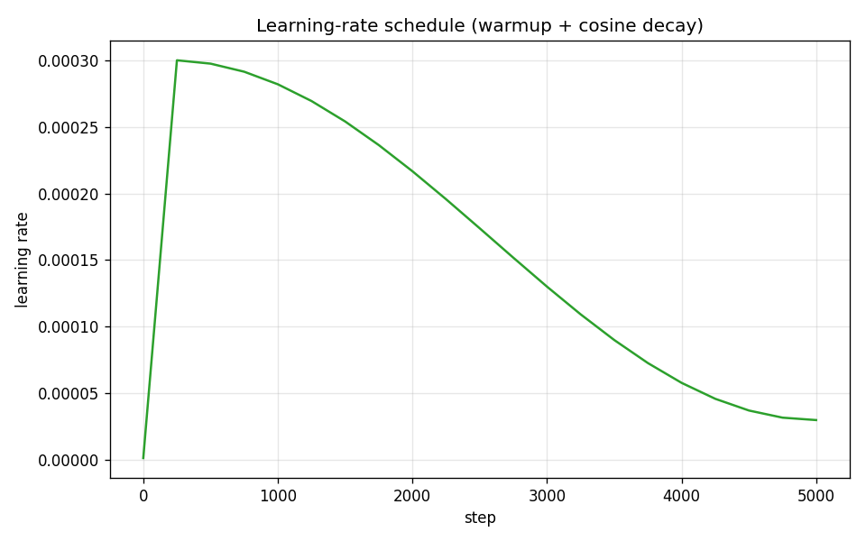

# char-transformer-from-scratch

A decoder-only Transformer (GPT-style) implemented from scratch in PyTorch for
character-level text generation. No `nn.Transformer`, no Hugging Face — the
attention, multi-head wiring, positional embeddings, training loop, and sampler
are all written by hand so the internals are fully visible.

I built this to understand exactly what happens inside a GPT block: how causal
self-attention is masked, how heads are split and recombined, how the cosine
warmup schedule shapes optimization, and how autoregressive sampling actually
works. It trains on CPU on the ~1 MB Tiny Shakespeare corpus and generates
Shakespeare-flavored dialogue.

## Results

A 0.83M-parameter, 4-layer model trained for 5,000 steps on CPU (single run,
seed 1337):

| Metric                | Train | Validation |
|-----------------------|-------|------------|
| Cross-entropy (nats)  | 1.428 | **1.633**  |
| Perplexity            | 4.17  | **5.12**   |
| Bits / character      | 2.06  | **2.36**   |

The model starts at a loss of ~4.21 — essentially the uniform baseline over the
65-character vocabulary (`ln 65 ≈ 4.17`, perplexity 65) — and converges to a
validation perplexity of **5.12**, i.e. at each step it is effectively choosing
among ~5 characters instead of 65. The small train/val gap (1.43 vs 1.63) shows
mild, expected overfitting at this capacity.




### Sample output

Unconditional sampling (`--temperature 0.8`), straight from the trained model:

```
MARCIUS:
Then I will be e make thee entreates my world;
And see not man made hath commed not the be pale.

FLORIZEL:
And Soper, and not words many of the fault make the treas;
Feel, confession. Have it my mother king,
And my soly drown propparey some our into have
Of your enough? Buckingham bark of mine warr
```

At the character level the model has learned the *shape* of a Shakespeare play —
speaker labels in caps, line breaks, dialogue rhythm, apostrophes, and mostly
real English words — without ever being told what a word is.

## Quick start

```bash
python -m venv .venv && source .venv/bin/activate
pip install -r requirements.txt

# download the ~1 MB Tiny Shakespeare corpus
python scripts/download_data.py

# train (~5k steps; runs on CPU)
python scripts/train.py --config configs/default.yaml --device cpu

# generate text from the best checkpoint
python scripts/generate.py --checkpoint checkpoints/best.pt --prompt "ROMEO:" \
    --max-new-tokens 500 --temperature 0.8 --top-k 40

# evaluate + plot the recorded training curves
python scripts/evaluate.py --checkpoint checkpoints/best.pt --reports-dir figures
```

Want a quick smoke run instead of the full schedule?

```bash
python scripts/train.py --max-steps 200 --warmup-steps 20 --out-dir checkpoints/smoke
```

## Project layout

```
src/char_transformer/   core package
  config.py             typed dataclass config, YAML load/save
  tokenizer.py          character <-> id mapping
  data.py               corpus load, train/val split, batch sampling
  model.py              GPT: causal attention, blocks, generation (from scratch)
  lr_schedule.py        warmup + cosine-decay learning rate (pure function)
  trainer.py            training loop, AdamW, eval estimation, checkpointing
  evaluation.py         loss + perplexity metrics
  plotting.py           loss-curve and LR-schedule plots
  checkpoint.py         save/load weights + config + tokenizer + history
  utils.py              device resolution, seeding
scripts/                CLI entry points (download, explore, train, generate, evaluate)
configs/                YAML hyperparameter configs
tests/                  pytest suite (62 tests)
figures/                committed training curves + sample metrics
```

## Architecture in one paragraph

Tokens (characters) are embedded and summed with learned positional embeddings,
then passed through 4 pre-norm Transformer blocks. Each block is causal
multi-head self-attention (4 heads, hand-rolled scaled dot-product with a
lower-triangular mask) followed by a 4× GELU feed-forward, both wrapped in
residual connections. A final LayerNorm and a linear head project back to the
65-way vocabulary for next-character prediction. Weights use the GPT-2 init
(normal 0.02, residual projections scaled by `1/sqrt(2·n_layer)`). See
[`model.py`](src/char_transformer/model.py).

## Why character-level?

A character vocabulary is tiny (~65 symbols for Shakespeare), so there is no
subword tokenizer to train and the embedding/output layers stay small. That
keeps the whole thing CPU-trainable while still exercising every part of a real
Transformer: embeddings, causal attention, residual blocks, an LR schedule, and
autoregressive sampling.

## Tests

```bash
python -m pytest
```

62 tests cover tokenizer roundtrips, batch shapes, attention causality, the LR
schedule edges, checkpoint roundtrips, the trainer step, and generation bounds.

For the full design rationale, data details, methodology, and tradeoffs, see
[DOCUMENTATION.md](DOCUMENTATION.md). For intended use and limitations, see
[MODEL_CARD.md](MODEL_CARD.md).
